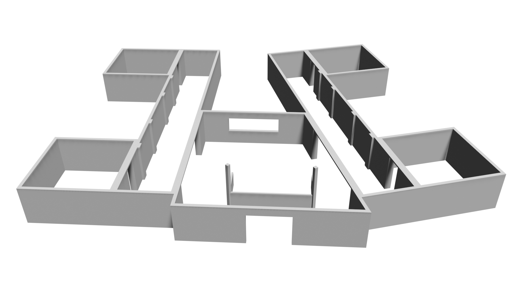
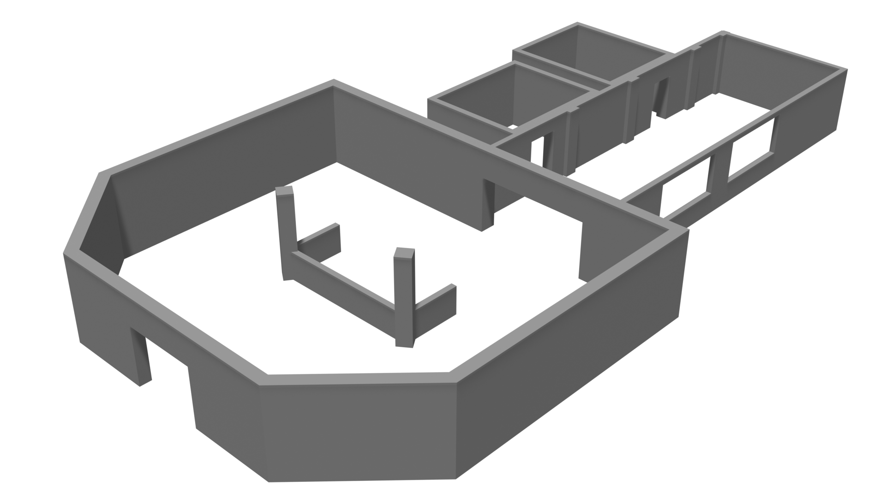

# FloorPlan DSL

The FloorPlan DSL is a model-driven approach to specify indoor environments. The language enables developers to model indoor environments by its components such as spaces, entryways, and other features such as windows and columns; allowing the re-creation of real-world environments, or the creation of new ones. The models can be transformed into 3D meshes and occupancy grid maps, which can be used to simulate robot navigation tasks in most robot simulators. 



## Features

* **Create simulation environments**: The tooling supports the transformation of floor plan descriptions into 3D models in STL and Collada formats, which are standard formats supported by numerous simulators.   
* **Direct simulation of navigation tasks**: The tooling also generates corresponding occupancy grid maps and configuration files for the direct simulation and execution of navigation-related tasks. 
* **Create variation**: Through the Variation DSL, a companion language, variation points for all spatial relations can be specified with probability distributions. The tools generate new concrete floor plans by sampling the distributions.
* **Easy to extend**: The tool can also transform the floor plan description into composable models in JSON-LD format. These composable models enable the extension of the descriptions and the tooling. 

## Installation

It is strongly recommended to use Docker to install and use the FloorPlan DSL and other tools. 

### Installation through Docker

If not installed already, install docker as documented [here](https://docs.docker.com/engine/). From the root directory of this repository, build the docker image:

```
docker build . --tag floorplan:latest
```

This will build the container and assign the string `floorplan:latest` as a tag to run the correct container. To run the container execute the following command after replacing the correct paths inside the angle brackets: 

```
docker run -v $<local output folder>:/usr/src/app/output -v $<local input folder>:/usr/src/app/models -it floorplan:latest bash
```

Important *required* options of the command:
+ `-v $<local output folder>:/usr/src/app/output`: This will map a local folder of the computer with the output folder of the container, this allows the FloorPlan DSL tooling to write the artefacts directly in the local computer.
+  `-v $<local input folder>:/usr/src/app/models`: This will map a local folder of the computer with the input folder of the container, any models in the local input folder can be accessed by the FloorPlan DSL tooling.
+ `-it`: required to make the container interactive.
+ `bash`: required to make the container interactive. 

### Native installation (Ubuntu 24.04)

Install all the requirements:

```shell
sudo apt-get install blender python3-pip python3-venv -y
```

First, create a virtual environment and activate it: 

```shell
python -m venv .venv
source .venv/bin/activate
```
For Blender to regonize the virtual environment, add it to your `PYTHONPATH`:

```shell
export PYTHONPATH=<Path to .venv directory>/lib/python3.11/site-packages   
```

From the root directory of the repo, install the python packages by running: 

```shell
pip install -e .
```

This will install the languages and generators. To confirm that the languages have been installed, execute the commands: `textx list-languages` and `textx list-generators`. The names of the languages should appear in the output:

```shell
> textx list-languages
...
exsce-floorplan-dsl (*.floorplan)exsce-floorplan[0.0.1]                  A language to model indoor environments
exsce-variation-dsl (*.variation)exsce-floorplan[0.0.1]                  A language to variate models from ExSce

> textx list-generators
...
exsce-variation-dsl -> exsce-floorplan-dslexsce-floorplan[0.0.1]        Generate variations of indoor environments from .floorplan models
```

## Getting started

### Generating 3D meshes and occupancy grid maps

This tool is currently in active development. To use the tool you can execute the following command: 

```
blender --background --python exsce_floorplan/exsce_floorplan.py --python-use-system-env -- <model_path>
```

Optionally, you can remove the `--background` flag to see directly the result opened in Blender.

***Note**: The `--` before `<model_path>` is intentional and important.*

#### Example



An example model for a building is available [here](models/examples/hospital.floorplan). To generate the 3D mesh and occupancy grid:


```
blender --background --python exsce_floorplan/exsce_floorplan.py --python-use-system-env -- ../models/examples/hospital.floorplan
```

That should generate the following files:

```
.
├── map
│   ├── hospital.pgm
│   └── hospital.yaml
└── mesh
    └── hospital.stl
```

The output path for the generated models in configurable (see [confg/setup.cfg](config/setup.cfg) and note they are relative paths from where you're calling the command).

The `.stl` mesh can now be used to specify the Gazebo models and included in a Gazebo world. See, for example, [this tutorial](https://classic.gazebosim.org/tutorials?tut=import_mesh&cat=build_robot).

### Generating the composable model representation

To generate the JSON-LD representation of the FloorPlan model, simply use textX's language generators:

```
textx generate <floorplan model> --target json-ld --output-path <output path>
```

For example: 

```
textx generate models/examples/brsu_building_c_with_doorways.floorplan --target json-ld --output-path .
```

### Tutorials

Modelling an environment can be straightforward with some background information on how the concepts are specified and related to each other. [This tutorial](docs/Tutorial.md) will explain the concepts of the language and how to position them in the environment. An overview of the concepts and their attributes is available [here](docs/concepts.md). A tutorial on the variation DSL is also available [here](docs/Variation.md).

## Citation

If you use our tooling and approach please cite our paper as follows:

```
@inproceedings{parra2023iros,
    author = {Parra, Samuel and Ortega, Argentina and Schneider, Sven and Hochgeschwender, Nico},
    title = {{A Thousand Worlds: Scenery Specification and Generation for Simulation-Based Testing of Mobile Robot Navigation Stacks}},
    booktitle = {Proceedings of the IEEE International Conference on Intelligent Systems and Robots (IROS)},
    year = {2023}
}
```

## Acknowledgments

This work is part of a project that has received funding from the European Union's Horizon 2020 research and innovation programme SESAME under grant agreement No 101017258.

<p align="center">
    
    
</p>
