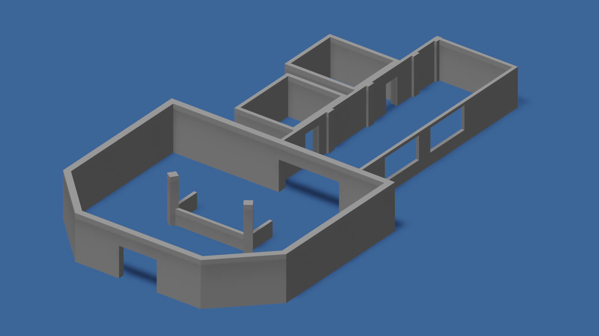
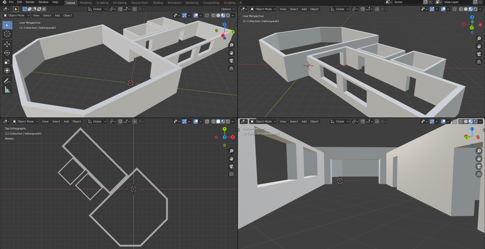

# Floor Plan DSL

Floor Plan DSL is a model-driven approach to describe indoor environments. The model-driven tool enables developers to model the environment by its components such as spaces, entryways, and other features such as windows and columns; allowing the recreation of real world environments, or the creation of new ones. The models get transformed into 3D meshes and occupancy grid maps, which can be used to simulate robot navigation tasks in most robot simulators. 



# Installation

Install all the requirements:
* [Python 3](https://www.python.org/downloads/)
* [Blender](https://www.blender.org/download/) (tested on v2.82a)
* [TextX](http://textx.github.io/textX/3.0/) 

Alternatively, you can install all requirements (except for blender) with `pip3 install -r requirements.txt`

# Getting started

## Usage

This tool is currently in active development. To use the tool you can execute the following command:

```
blender --background --python exsce_floorplan/exsce_floorplan.py --python-use-system-env -- <model_path>
```

Optionally, you can remove the `--background` flag to see directly the result opened in Blender.

***Note**: The `--` before `<model_path>` is intentional and important.*

***Note:** This tool has been tested on an ubuntu machine with Blender v2.82a* 

## Example



An example model for a building is available in [here](models/hospital.floorplan)

```
blender --python exsce_floorplan/exsce_floorplan.py --python-use-system-env -- models/hospital.floorplan
```

The output of the tooling is available in the [output folder](output).

## Tutorial

Modelling an environment can be straight-forward with some background information on how the concepts are specified and related to each other. [This tutorial](docs/Tutorial.md) will explain the concepts of the language and how to position them in the environment. An overview of the concepts and their attributes is available [here](docs/concepts.md)

# Acknowledgement

This work is part of a project that has received funding from the European Union's Horizon 2020 research and innovation programme SESAME under grant agreement No 101017258.

<p align="center">
    
    
</p>