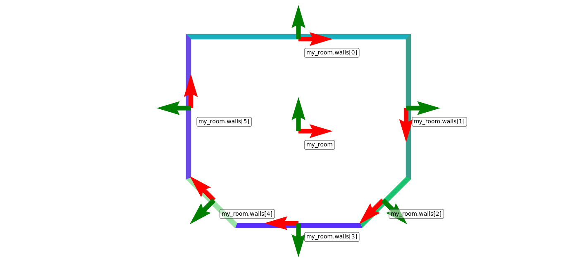
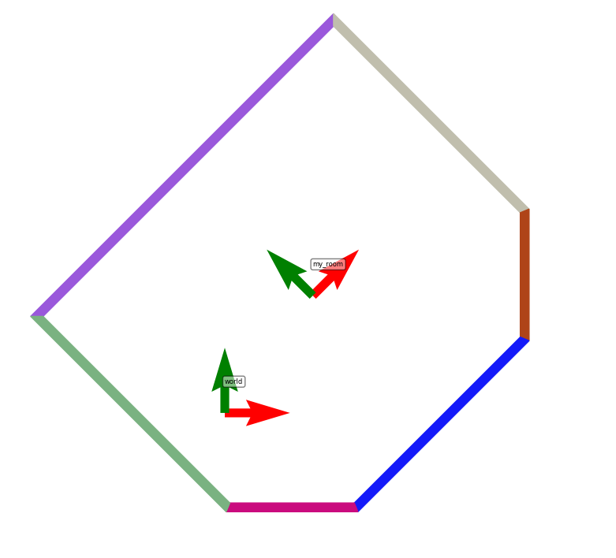
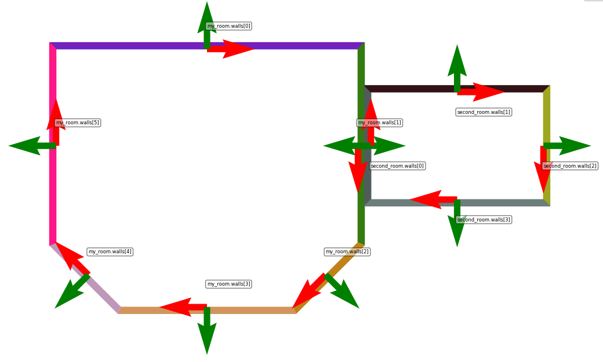
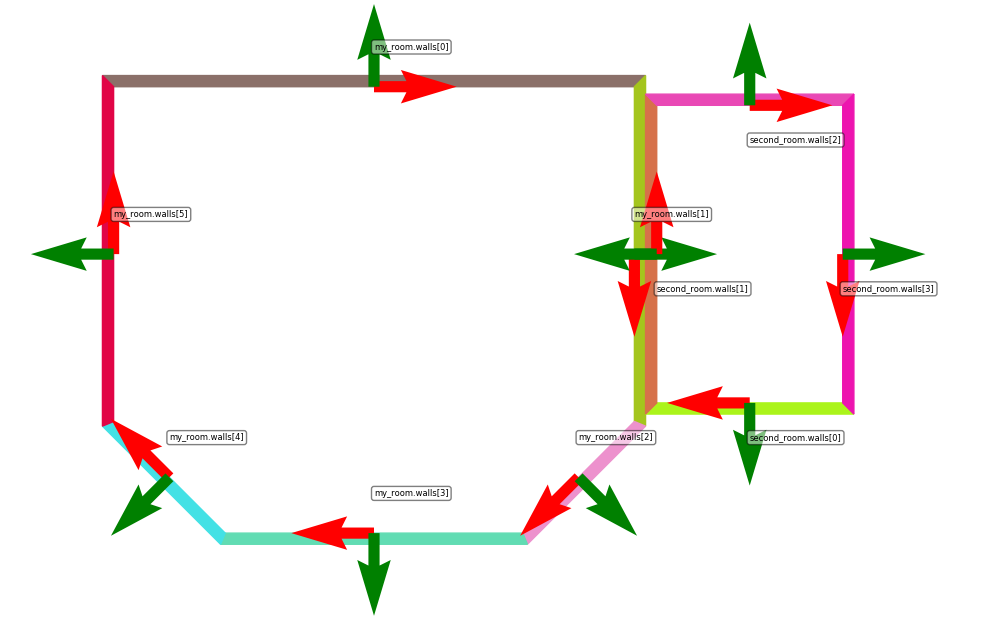
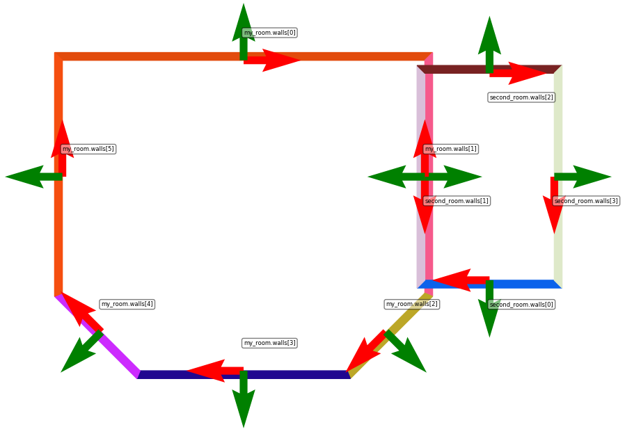

# How to specify an indoor environment

The ExSce-FloorPlan DSL is a domain-specific language for specifying an indoor environment. In this tutorial we are going to go over the most important concepts to model a concrete indoor environment. 


The goal of this tutorial is to create the environment above. We will go over concepts such as Spaces, Entryways, and other features in order to specify a specific environment. 

## Concepts available
Let's do a review of the most important concepts when modeling an indoor environment:
* Spaces: these are the central concepts when modeling. This concept allows you to model any space in a floor plan: a room, a hallway, an intersection, a reception, and any other space that is surrounded by walls. 
* Walls: walls surround the spaces, however these are not modeled directly. When modeling a space, you select the shape of the space, and the walls are created with the space. 
* Entryways and Windows: These are openings in the walls that allow you to connect two spaces. 
* Column and Dividers: These are features of the environments that are usually located freely in space or next to walls. Both cases can be modeled using the language. 

## Modeling
Modeling an indoor environment consists of modeling Spaces, Entryways, Windows, Columns, and Dividers; and specifying their location in the environment. Modeling these concepts is rather straightforward as we only have to specify its shape and other attributes such as thickness or height. Specifying the location is simple, but requires some background.

The location of any space or feature is specified by a translation and rotation with regards to a frame of reference. There are multiple frames of references that can be chosen. Apart from the world frame, each space has N + 1 frames of references, where N is the number of walls. For each wall in the space, there is a frame located in the middle of the wall, with the x axis going along the wall and the y axis perpendicular to the wall. From the perspective of being inside the room looking into one of the walls: Positive values in the x axis are located from the center to the right, and negative values in the opposite direction. Whereas the positive direction from the y axis moves away from you and the negative direction moves closer. The frame is located at floor level, meaning that for the z axis only positive values are above the floor. 

 

The image above illustrates a room with all of its frames. Each wall has an index, so you can select the frame of reference by specifying the index of the desired wall: `<name of space>.walls[<index>]`. You can also select the frame of the space by just referring to the name: `<name of space>`. You may also select the world frame with the `world` keyword.

A space requires two frames in order to specify a location: A reference frame where the translation and rotation are specified from, and the frame that will get translated and rotated.

### Using the world frame

You can select the world frame as your frame of reference by using the `world` keyword only for locating spaces. Any other feature or entryway must be specified by either the space frame or one of the walls.

```
location:
    from: world
    to: this
    pose:
        translation: x:3.0 m, y:4.0 m
        rotation: 45.0 deg
```


Should be noted that you can use the `this` keyword to reference a frame when you are inside the scope of a space. i.e. that the frame belongs to the space you are editing.

### Using another wall

When you model a location using two wall frames, the default behaviour is to do an extra 180 degree rotation of the space you are locating so that the two spaces are not overlapping, as illustrated in the two next examples:

```
location:
    from: my_room.walls[1]
    to: second_room.walls[0]
    pose:
        translation: x:0.0 m, y:0.0 m
        rotation: 0.0 deg
    spaced
```


```
location:
    from: my_room.walls[1]
    to: second_room.walls[1]
    pose:
        translation: x:0.0 m, y:0.0 m
        rotation: 0.0 deg
    spaced
```


The flag `spaced` is used to tell the interpreter to calculate the combined thickness of the two walls, and space the two rooms accordingly. When not present, the two rooms are not spaced correctly:



Similarly, the default alignment behaviour can be disabled by using the `not aligned` flag, so that the two rooms overlap.

```
location:
    from: my_room.walls[1]
    to: second_room.walls[1]
    pose:
        translation: x:0.0 m, y:0.0 m
        rotation: 0.0 deg
    not aligned
```


### Features

Other features of the environment only need one reference frame. For entryways and windows, the frame must be a wall frame.

```
Entryway doorway:
    in: my_room.walls[0] and second_room.walls[1]
    shape: Rectangle width=1.0 m, height=1.8 m
    pose:
        translation: x: -1.0 m, y: 0.0 m, z: 0.0 m
        rotation: 0.0 deg
```
Whenever an entryway or window is located in a wall shared by two spaces, you must specify the two walls that will contain the entryway or window. The location is specified with regards to the first frame specified, in the example above it would be `my_room.walls[0]`.

Features such as columns or dividers are always defined within a space scope, so you can use the "this" keyword to refer to the walls inside the space.
```
Column wall_column:
    shape: Rectangle width=0.5 m, length=0.3 m
    height: 2.5 m
    from: this.walls[3]
    pose:
        translation: x:7.0 m, y:0.0 m
        rotation: 0.0 deg
```
### Modeling 

Now that we have reviewed all of the important concepts, we can put them together in a model. The finished model for this tutorial is available [here](models/hospital.floorplan), here we will go over the model section by section with some explanations when needed. 

```
Floor plan: hospital

    Space reception:
        shape: Polygon points:[
            (-7.0 m, 6.0 m),
            (7.0 m, 6.0 m),
            (7.0 m, -3.0 m),
            (4.0 m, -6.0 m),
            (-4.0 m, -6.0 m),
            (-7.0 m, -3.0 m)
        ]
        location:
            from: world
            to: this
            pose:
                translation: x:0.0 m, y:-5.0 m
                rotation: 45.0 deg
```

Each floor plan has a name, which gets used for all the artifacts that get generated. The `reception` space has a custom polygon as shape, so we specify all the points to bound it. Every pair of points is a wall, with the last point and the first point being the final wall to close the polygon (i.e. no need to repeat the first point at the very end). From the world frame, this space is translated -5 meters in the y axis and rotated 45 degress w.r.t. the z axis. 

```
        ...
        wall thickness: 0.40 m 
        wall height: 3.0 m
        features:
            Column central_left:
                shape: Rectangle width=0.5 m, length=0.5 m
                height: 3.0 m
                from: this
                pose:
                    translation: x:-2.5 m, y:0.0 m
                    rotation: -35.0 deg
        ...
```
The `reception` space will have a wall thickness of 0.4 meters and a wall height of 3 meters. These values don't have to be specified for every space, as default values will be set later for all spaces. Nested in the feature concept, columns and dividers can be specified. The reference frame for these is always part of the space (either the main frame or a wall frame of the `reception` space)

```
    Space hallway:
        shape: Rectangle width=5.0 m, length=14.0 m
        location:
            from: reception.walls[0]
            to: this.walls[2]
            pose: 
                translation: x:2.0 m, y:0.0 m
                rotation: 0.0 deg
            spaced
        ...

    Space room_A:
        ...
    
    Space room_B:
        ...
```
The hallway is located using two wall frames, and the flag `spaced` is present so that the interpreter calculates spacing necesary to avoid overlapping in between the spaces. Two other spaces also get defined in a similar way.

```
    Entryway reception_main: 
        in: reception.walls[3]
        shape: Rectangle width=2.5 m, height=2.0 m
        pose:
            translation: x:0.0 m, y: 0.0 m, z: 0.0 m
            rotation: 0.0 deg

    Entryway reception_hallway: 
        in: reception.walls[0] and hallway.walls[2]
        shape: Rectangle width=4.0 m, height=2.0 m
        pose:
            translation: x: 2.0 m, y: 0.0 m, z: 0.0 m
            rotation: 0.0 deg
    
    ...
    Window hallway_window_1:
        in: hallway.walls[1]
        shape: Rectangle width=3.0 m, height=1.5 m
        pose:
            translation: x: 3.0 m, y: 0.0 m, z: 0.8 m
            rotation: 0.0 deg
```

Two entryways and one window are modeled, each with a unique name. In the case of the second entryway, since it connects two spaces we must specify the two walls where the entryway is located. Notice that for windows we have to specify a translation in the z axis. 

```
    Default values:
        Wall thickness: 0.23 m
        Wall height: 2.5 m 
```
At the very end of the model the default values for all the spaces must be specified. 

## How to generate 3D files and occupancy grid maps

To interpret the model and get artefacts, you only need to run one command:

```
blender --python exsce_floorplan/exsce_floorplan.py --background --python-use-system-env -- <path to model>
```

The `--` after the variable paths are important to distinguish the blender parameters and the parameters for the tooling