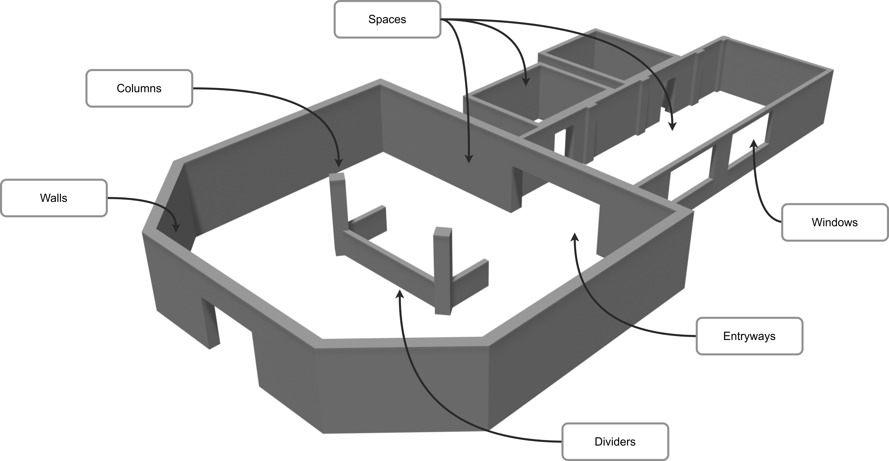

<details open markdown="block">
  <summary>
    Table of contents
  </summary>
  {: .text-delta }
1. TOC
{:toc}
</details>


# How to specify an indoor environment
{: .no_toc}

The ExSce-FloorPlan DSL is a domain-specific language and tooling for specifying and generating indoor environments. In this tutorial we are going to go over the most important concepts to model a concrete floor plan.



The goal of this tutorial is to create the environment above. We will go over concepts such as Spaces, Entryways, and other features in order to specify a specific environment.


## Concepts available

Let's do a review of the most important concepts when modelling an indoor environment:

- Spaces: these are the central concepts when modelling. This concept allows you to model any space in a floor plan: a room, a hallway, an intersection, a reception, and any other space that is surrounded by walls.

- Walls: walls surround the spaces, and these are not modelled directly. When modelling a space, you select the shape of the space, and the walls are created automatically when interpreting the model.

- Entryways and Windows: These are openings in the walls that allow you to connect two spaces.

- Column and Dividers: These are features of the environments that are usually located freely in space or next to walls. Both cases can be modelled using the language.

The detailed documentation of these concepts can be found [here](../concepts.md).

## Modelling

Modelling an indoor environment consists of declaring the Spaces, Entryways, Windows, Columns, and Dividers; and specifying their location in the environment. Each of these concepts is modelled by specifying its shape and other attributes such as thickness or height. Specifying the location is simple, but requires some background.

### Conventions

In the examples below, you will notice some conventions for the frames of reference of each element.
Conventions for the frames and the locations of the floorplan elements can be found [here](../concepts.md).

#### Z-axis

Most of the descriptions assume you are modelling the floor plan using a top-down view, with the `z` axis pointing outside of your screen.

## Modelling the example

Now that we have reviewed all of the important concepts, we can put them together in a model. The finished model for this tutorial is available [here](../models/hospital.fpm). In this section we will go over the model section by section with some explanations when needed.

```
Floor plan: hospital

    Space reception:
        shape: Polygon points:[
            (-7.0 m, 6.0 m),
            (7.0 m, 6.0 m),
            (7.0 m, -3.0 m),
            (4.0 m, -6.0 m),
            (-4.0 m, -6.0 m),
            (-7.0 m, -3.0 m)
        ]
        location:
            wrt: world
            of: this
            translation: x:0.0 m, y:-5.0 m
            rotation: z: 45.0 deg
```

Each floor plan has a name, which gets used to identify all the artefacts that get generated. The `reception` space has a custom polygon as shape, so we specify all the points to bound it. Every pair of points is a wall, with the last point and the first point being the final wall to close the polygon (i.e. no need to repeat the first point at the very end). From the world frame, this space is translated -5 metres in the y axis and rotated 45 degrees w.r.t. the z axis.

```
        ...
        wall:
            thickness: 0.40 m
            height: 3.0 m
        features:
            Column central_left:
                shape: Rectangle width=0.5 m, length=0.5 m
                height: 3.0 m
                location:
                    wrt: this
                    translation: x:-2.5 m, y:0.0 m
                    rotation: z: -35.0 deg
        ...
```

The `reception` space will have a wall thickness of 0.4 metres and a wall height of 3 metres. These values don't have to be specified for every space, as default values will be set later for all spaces. Nested in the feature concept, columns and dividers can be specified. The reference frame for these is always part of the space (either the space frame or a wall frame of the `reception` space)

```
    Space hallway:
        shape: Rectangle width=5.0 m, length=14.0 m
        location:
            wrt: reception.walls[0]
            of: this.walls[2]
            translation: x:2.0 m, y:0.0 m
            rotation: z: 0.0 deg
            spaced
        ...

    Space room_A:
        ...

    Space room_B:
        ...
```

The hallway is located using two wall frames, and the flag `spaced` is present so that the interpreter calculates spacing necessary to avoid overlapping in between the spaces. Two other spaces also get defined in a similar way.

```
    Entryway reception_main:
        shape: Rectangle width=2.5 m, height=2.0 m
        location:
            in: reception.walls[3]
            translation: x:0.0 m, y: 0.0 m, z: 0.0 m
            rotation: y: 0.0 deg

    Entryway reception_hallway:
        shape: Rectangle width=4.0 m, height=2.0 m
        location:
            in: reception.walls[0] and hallway.walls[2]
            translation: x: 2.0 m, y: 0.0 m, z: 0.0 m
            rotation: y: 0.0 deg

    ...
    Window hallway_window_1:
        shape: Rectangle width=3.0 m, height=1.5 m
        location:
            in: hallway.walls[1]
            translation: x: 3.0 m, y: 0.0 m, z: 0.8 m
            rotation: y: 0.0 deg
```

Two entryways and one window are modelled, each with a unique name. In the case of the second entryway, since it connects two spaces we must specify the two walls where the entryway is located. Notice that for windows we have to specify a translation in the z axis.

```
    Default values:
        walls:
            thickness: 0.23 m
            height: 2.5 m
```

At the very end of the model the default values for all the spaces must be specified.
