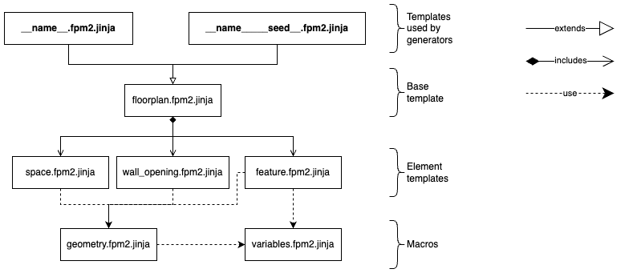

## Background

### FloorPlan DSL

The FloorPlan DSL is a language to specify models of indoor environments. It is modelled using [textX](https://textx.github.io/textX/) (a Python-based Xtext-inspired meta-language). It also includes a [Variation DSL](Variation.md) to generate variations of a base floor plan by sampling a variety of distributions.

A floor plan is composed of the following concepts:
- [Spaces](concepts.md#shapes) are used to model enclosed rooms
- [Features](concepts.md#floor-features) such as [columns](concepts.md#column) or [dividers](concepts.md#divider)
- Openings such as [windows](concepts.md#window) or [entryways](concepts.md#entryway)

Each of them has a [shape](concepts.md#shapes). The locations of spaces and features are specified with respect to one another or to a wall. The locations of openings are specified with respect to the wall they are in. A tutorial on [how to model a floor plan](Tutorial.md) describes how to model each of these concepts step by step.

### Composable model representation

In parallel to the design of this DSL, a modelling approach to specify *composable models* using [JSON-LD](https://www.w3.org/TR/json-ld/) was being developed.
A more thorough introduction to the composable models can be found [here](https://github.com/secorolab/modelling-tutorial), but for the purposes of this document a brief overview of its relevant aspects follows. 
The main idea is to use linked data to represent models in JSON. 
All elements in a model have unique IDs that other elements can reference in their properties.
This allows us to model different domains or aspects separately, and later compose those separate specifications into a graph of linked objects (where edges are the references between unique IDs).
With this graph representation, it is possible to query and make inferences about the model and its elements, using, for example, Resource Description Framework (RDF) tools (e.g, [rdflib ](https://rdflib.readthedocs.io/en/stable/)). 

However, modelling in JSON-LD is cumbersome, so the FloorPlan DSL became the "front-end" DSL for users, since it is more human-friendly.
After a model is specified using the DSLs, a JSON-LD representation (that conforms to the [JSON-LD metamodels](https://github.com/secorolab/metamodels)) can be generated.
Note that due to their composability, there is no one true/single schema to check for well-formedness of a particular type of composable model. This makes the generation of the JSON-LD representation challenging, since the JSON-LD metamodels do not describe the structural constraints (the schema to *conform* to) but only the available types.

The json-ld generator outputs the following files:

```bash
.
├── coordinate.json # Coordinates of the positions and poses in spatial_relations.json
├── floorplan.json # Composition of the floorplan and its elements
├── shape.json # Polygons for spaces and walls
├── skeleton.json # Points and frames for all elements
└── spatial_relations.json # Descriptions of positions and poses
```

### textX (and differences to Xtext)

Two main differences to Xtext influence the design decisions in the FloorPlan DSLs:

- Static semantics: no constraint language like OCL, but has [object and metamodel processors](https://textx.github.io/textX/metamodel.html#processors) to apply static semantics (using python code for validation/checks)
- No transformation language available. [Generators](https://textx.github.io/textX/registration.html#textx-generators) can be written in Python to transform to other representations, or use the [Jinja](https://textx.github.io/textX/jinja.html) template engine for model-to-text transformations. 

For a more detailed comparison, see the [comparison to other tools](https://textx.github.io/textX/about/comparison.html) in the textX website.

##### Jinja

The templating engine has some useful utilities to minimize duplication of code:
- [inheritance](https://jinja.palletsprojects.com/en/3.1.x/templates/#template-inheritance): templates can **extend** other templates
- [macros](https://jinja.palletsprojects.com/en/3.1.x/templates/#macros): functions to abstract and reuse pieces of code
- [includes](https://jinja.palletsprojects.com/en/3.1.x/templates/#include): rendering a template at the location where this tag is invoked

## Motivation for the refactoring of the FloorPlan DSL

- Migrating the generation of the 3D mesh to the [scenery_builder](https://github.com/secorolab/scenery_builder) required that 3D data would be exported to the JSON-LD representations (see issues below). 
- Modelling some floor plan elements for their use with the [scenery_builder](https://github.com/secorolab/scenery_builder) is currently done directly in JSON-LD. These elements have available JSON-LD models and metamodels. 
	- [door objects](https://github.com/secorolab/floorplan-object-modelling-and-placement/blob/master/input/object-door.json) (their shape and kinematic chains)
	- [states of objects](https://github.com/secorolab/floorplan-object-modelling-and-placement/blob/master/input/object-door-states.json)
	- [door instances](https://github.com/secorolab/floorplan-object-modelling-and-placement/blob/master/input/object-door-instance-1.json) (with poses and states attached)

## Identified issues with the `floorplan-v1` (formerly `exsce-floorplan`) DSL

- No 3D-data was included in the generated JSON-LD models (e.g. no height was exported for walls, dividers or columns)
- Inconsistencies in the specification of locations for different elements.
    - Syntax is different between different types of elements. 
    - Some location concepts are defined outside the location model
    - Abstraction levels: Features are defined inside the space model, but openings are defined outside of them, despite the relations between them, e.g. Dividers and Entryways
- Model transformations (from textX models to JSON-LD models) used a hard-coded "transformation engine" written in Python. This was error-prone and resulted in the following issues:
	- No validation of model correctness (JSON-LD metamodels are not used in the transformation)
	- Metamodel names in textX do not match JSON-LD metamodels for the same concepts
	- Missing elements in the JSON-LD generation (in addition to 3D data):
		- Doors are modelled as "Dividers" but no JSON-LD is generated for them. Features were missing from some JSON-LD exports.
		- Entryways and Windows were also not exported
    - The custom classes used to parse the model do not respect separation of concerns. Out of convenience, they mix semantics of the language with the interpretation required for some of the exports.
        - They use additional classes which are not part of the textx grammar and models, but have corresponding JSON-LD metamodels and are generated "out of thin air"  part of the json-ld models (since they do not exist in the textx model AST).
    - Units are part of the syntax but are ultimately ignored (i.e. no checks if angles are specified in radians or degrees)
	- Abstraction level was inconsistent for some elements (e.g. AngleInDegrees or MeterVariable)
- Duplicated/repeated models due to lack of modularity (e.g. in `models/examples/` three models of `brsu_building_c` add or remove features and openings but share the same spaces)
- Code principles
    - Custom classes also do not have consistent levels of abstraction to match their domain concepts. They perform functions that do not match their level of abstraction or ar part of the semantics. As an example, `Frames` have translation and rotation matrices and perform transformation of positions and poses.
    - Generally, the methods in custom classes don't follow the principle of single responsibility, and have duplicated code.


## Goals of the refactoring

1. Refactoring the textX metamodels
    1. Making the level of abstraction top-down
    2. Renaming concepts to align with the JSON-LD ones where applicable
    3. Expand language semantics to facilitate the generation of JSON-LD models
    4. Custom classes that match the semantics of the concepts in the model and have appropriate levels of abstraction.
2. Model-to-text transformations that follow the JSON-LD metamodels.
    Challenge: There is no transformation language available. textX has ways to register [generators](https://textx.github.io/textX/registration.html#textx-generators) but this relies on the custom-written code of the transformation engine. JSON-LD metamodels only include types but no pre-defined schema
    1. Systematically generate JSON-LD models to include all textx models
    2. Add 3D data to JSON-LD generation
3. Validation of models (e.g. unit consistency)
4. Creating new textX metamodels for the new doors
5. Modularity of the models to enable their reuse

## Implementation

The structure of the repository was completely reorganized for v2.
With the exception of some code optimization/deduplication, most of the original version of the floorplan is still in this repository to enable the v1-v2 conversion and to validate that v2 can produce the same json-ld representation as v1.
Once the latter has been successfully completed, most likely only the v1 grammar will be kept (to allow for v1-v2 conversion), and eventually removed once v1 can be fully deprecated.
The repository is currently organized as follows: 

<!-- TODO: Describe repository structure, including artefacts. Describe what is old and what is new and why it was kept -->

```bash
.
├── models
│   └── examples # Mainly contains models from v1
│       ├── ...
│       ├── hbrs.floorplan
│       ├── hbrs.fpm2 # Example of converted model from v1 to v2
│       ├── hbrs.variation # Updated for v2
│       ├── hospital.floorplan
│       ├── hospital.fpm2    # Manually specified to demonstrate model optimization
│       ├── hospital.variation # Updated for v2
│       ├── kitchen.floorplan 
│       ├── kitchen.fpm2 # Example of converted model from v1 to v2
│       ├── kitchen.variation # Updated for v2
│       └── ...
├── src
│   └── floorplan_dsl
│       ├── classes # Custom classes used for parsing into Python AST
│       │   ├── fpm1
│       │   │   ├── __init__.py
│       │   │   ├── floor_feature.py
│       │   │   ├── geometry.py # Frame (not explicitly modelled)
│       │   │   ├── helpers.py
│       │   │   ├── polytope.py
│       │   │   ├── position.py
│       │   │   ├── space.py
│       │   │   ├── wall.py # Not explicitly modelled
│       │   │   └── wall_opening.py
│       │   ├── fpm2
│       │   │   ├── __init__.py
│       │   │   ├── floorplan.py
│       │   │   ├── geometry.py
│       │   │   ├── qudt.py
│       │   │   └── variables.py
│       │   ├── variation
│       │   │   ├── __init__.py
│       │   │   └── distribution.py
│       │   └── __init__.py
│       ├── generators # Code to read templates and pass the model to jinja
│       │   ├── __init__.py
│       │   ├── fpm.py # v1-v2 conversion, json-ld
│       │   └── variations.py # variations
│       ├── grammar
│       │   ├── fpm1 # The original grammar of v1
│       │   │   ├── floorplan.tx
│       │   │   ├── geometry.tx
│       │   │   └── polytope.tx
│       │   ├── fpm2 # The new grammar added in v2
│       │   │   ├── floorplan.tx
│       │   │   ├── geometry.tx
│       │   │   ├── units.tx
│       │   │   ├── variables.tx
│       │   │   └── walls.tx
│       │   └── variation # Minor updates from v1 to v2
│       │       ├── distributions.tx
│       │       └── floorplan_variation.tx
│       ├── processors
│       │   ├── semantics # Static semantics in v2: model refinement 
│       │   │   ├── __init__.py
│       │   │   └── fpm2.py
│       │   ├── validation # Validation of constraints
│       │   │   ├── __init__.py
│       │   │   ├── fpm1.py
│       │   │   ├── fpm2.py
│       │   │   └── variation.py
│       │   └── __init__.py
│       ├── scoping # Reference resolution 
│       │   ├── __init__.py
│       │   └── fpm2.py
│       ├── templates # Jinja2 templates
│       │   ├── fpm2 # For floorplan v2 models (v1-v2 conversion and variations)
│       │   └── json-ld # For the generation of JSON-LD representations
│       │       ├── floorplan
│       │           ├── elements # floor plan concepts matching json-ld metamodels
│       │       │   └── structural-entities # Templates extending base concepts in the geometry domain for the floor plan concepts
│       │       └── geometry # Base concepts in json-ld metamodels
│       │           ├── coordinate
│       │           ├── spatial-relations
│       │           └── structural-entities
│       └── registration.py # Registration of the languages and generators
└── test.sh # Tests the parsing, conversion from v1 to v2, and generation of variations and json-ld models 
```

### Refactoring of the textx metamodels

> [!NOTE] 
> **Status: Work in Progress**
> 
> The refactoring is almost finished. 
> Currently working on the implementation of the semantics for the `not aligned` and `spaced` keywords, and the interpretation of the location wrt to the world frame.
> Unit conversion will be worked on last.


- [x] Considered the requirements in the concrete syntax (what users can specify) separately from the abstract syntax that is needed to instantiate the floorplan (e.g. walls), and incorporated this as static semantics.
- [x] Model optimization: reduced model size by removing unnecessary statements in the concrete syntax (e.g. translations and rotations of zero). 
- [x] Made the specification of locations of elements consistent. This required a small change in syntax. 
- [x] Added metamodels in the grammar to better support the semantics of the geometry domain. This required considerable changes to the static semantics to better-align the textx grammar to the JSON-LD metamodels. This change also facilitates the generation of JSON-LD models, as most concepts are now present in the AST after parsing. Examples of this include: Frames, Points, Position and PoseCoordinates
- [x] Used textX's custom classes to do model refinement and expand the syntactic sugar (e.g., generating walls from the space's shape, adding a shape to each wall, adding frames and points to all elements, applying/propagating default values like wall height to model properties)
- [x] Updated the variation DSL and its generator to work with the new syntax.
    - In the generator implementation, the object processors that expand the semantics are disabled. This is required because rather than the precise *meaning* of the model, the variations are applied directly on the syntax elements, for example:

        ```
        Defaults:
            walls: 
                thickness: 0.23 m
                height: 2.5 m

        Space room_1:
            shape: Rectangle width = 1.0m length= 0.8m
            location:
                ...

        ```

        The `room_1.wall.thickness` is not specified. The semantics point the room's wall thickness to that of the global `Defaults.walls.thickness`. If we want to vary the room's thickness, we don't want to modify the (shared) global defaults, but rather the values specified in the model.

- [ ] Converted units internally to meters and radians for consistency.

Modularization of the grammar is discussed [below](#modularity-and-model-reuse).

### Model-to-text transformation
    
> [!NOTE] 
> **Status: Work in Progress**
> 
> The generation is currently working, however the generated JSON-LD models currently do not match the old versions for two reasons:
> - The semantics for `not aligned` and `spaced` have not yet been implemented
> - In the `v1`, the coordinates were transformed to frames of reference different to those that were specified in the concrete syntax. TBD if this is a design decision to be changed or if it should be added as an additional option for the generation in `v2`.

- [x] Using jinja2, we create templates for each (relevant) element type in the JSON-LD metamodels, in an attempt to use them as transformation rules (that call or extend the other more atomic element-level rules)
    - The transformation engine takes the textX model and applies the pre-defined Jinja2 templates. These templates take advantage of the Jinja facilities discussed in [Jinja](#jinja). We defined templates for each concept in the JSON-LD metamodels. The structure and inheritance of the json-ld templates is shown below: 
- [x] Model-to-model transformation from old version to new version also using jinja2. How the jinja templates are organized is shown below: 
- [ ] Add 3D representations to the JSON-LD generation
- [ ] Add options in generation to convert units (e.g. from cm->m or deg->rad)

### Validation 

> [!NOTE] 
> **Status: Paused**
> 
> Only the last two constraints still need to be implemented, but they require the implementation of the semantics for the `not aligned` and `spaced` keywords, and the interpretation of the location wrt to the world frame.

- [x] Verify that RHS variable assignments match the units of the LHS (validate type matches)
    - This was implemented with a processor in order to provide a more human-friendly message for the error. In the example below we try to assign an AngleVariable to a Rectangle that expects values in meters. 

    ```
    var doorway_width = 1.0 deg
    ...
            Divider door_doorway_01:
                shape: Rectangle width=0.1 m, length=doorway_width

    ```

    When the constraints were implemented as part of the syntax, an AngleVariable rule would be matched instead of a LengthVariable, and the error would be a failure to resolve the reference of `doorway_width` to a LengthVariable: 

    ```
    Error: /Users/argen/100 Projects/floorplan/dsl/models/examples/brsu_building_c_with_doors.fpm2:93:54: Unknown class doorway_width of class LengthVariable
    ```

    Implementing the validation of constraints in the processor, we can check the metamodel for the expected units and what the variable's units are:

    ```
    Error: /Users/argen/100 Projects/floorplan/dsl/models/examples/brsu_building_c_with_doors.fpm2:93:54: Expected an assignment in m. doorway_width has deg units
    ```
- [x] Verify the constraints in the directions that each element is allowed to be rotated and translated. The following constraints were implemented with a processor, as that allowed the reuse of the PointCoordinate/PositionVector and EulerAngle rules. It also allows us to check if one of the forbidden directions is specified but has a value of zero. 
    - [x] Only rotation in `y` for openings
    - [x] Only translation in `x` and `z` for openings
    - [x] Only rotation in `z` for spaces, walls and features
    - [x] Only translation in `x` and `y` for spaces, walls and features
- [x] Verify that the shape definitions match the allowed keywords as described in the [concepts](concepts.md), e.g. Rectangles should have `height` and not `length` for Openings. 
Similarly to the point above, the implementation was done through a processor to allow for the reuse of rules/models. We also validate that rectangles have non-zero positive values.
- [ ] Verify that openings have max. 2 wall frames as reference. 
    - [x] Max. 2 walls and min. 1: This is implemented through the syntax. Only the first two walls will be matched by the rule, and one wall is required.
    - [ ] For contiguous walls: min 2 wall frames are required. This most likely requires additional semantics and refinement of the models to recognize contiguous walls.
- [ ] Verify there are no opening shapes that go below the floor.
    This requires the implementation of the `not aligned` and `spaced` semantics, and the pose transformations wrt to the world frame.

### Adding door models

> [!NOTE] 
> **Status: Planned**
> 
> This part of the refactoring has not started yet

- [ ] Add new way to specify doors with kinematic chains (see IFC models as reference)
- [ ] Specificying the location of doors should also be possible wrt to a doorway. Currently dividers are specified wrt to spaces. 

### Modularity and model reuse

> [!NOTE] 
> **Status: Paused**
> 
> Initially each floor plan element had its own grammar, but this made the syntax cumbersome (see point below). 
> Most elements were moved back into a single file (`floorplan.tx`) until other parts of the refactoring are finished.


Two options (not necessarily mutually exclusive):

- [ ] Modularize the grammars to allow the reuse of model specifications (i.e., allow models to import other models)
    - Challenges: Limitations on what textx supports for importing grammars (circular references in space and feature locations). 
- [ ] Separate the specification of the element (space, feature, opening) separately from its location

